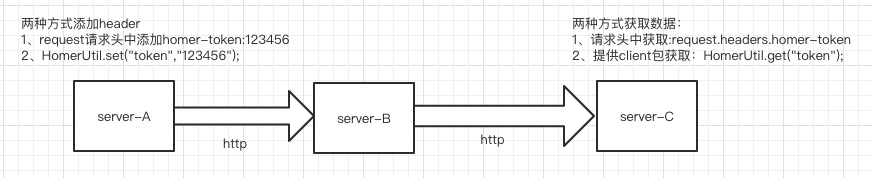

### Homer项目
homer:荷马，代号“信鸽”，意为信息传递，就好像信鸽一样，带着信息一路飞行。

#### 一、项目介绍

homer项目提供了这样的一种解决方案：通过Javaagent技术，为javaweb应用提供了无感知的header透传，尤其适用于现在springcloud的微服务项目，并为各种http客户端提供兼容。

#### 二、使用

##### 1、增加启动参数

项目使用javaagent方式，并且使用了阿里[transmittable-thread-local](https://github.com/alibaba/transmittable-thread-local)库解决异步线程和线程池下的ThreadLocal数据传递，ttl jar包已在项目中ext目录下，为了避免出现兼容性风险，推荐使用2.12.0版本。
所以在启动时，增加如下参数即可。
-javaagent:**yourpath**/kkb-homer-agent.jar -Xbootclasspath/a:**yourpath**/transmittable-thread-local-2.12.0.jar

##### 2、数据存取

* 通过httpheader方式：

  无论是前端还是java上游服务，都可以手动在request中添加header信息，需要注意的是，header信息必须以**homer-**作为前缀，以HttpClient为例，放入header：HttpRequest.addHeader("homer-token","123456");

  通过HttpServletRequest获取header，httpServletRequest.getHeader("homer-token").

* 通过HomerClient方式：

  homer会为应用提供一个homer-client工具包，用来很方便的存取key value，并且key**不用添加homer-**前缀，和HashMap使用方法类似，**推荐引入使用**。使用方法：

  HomerUtil.set("token","123456");

  HomerUtil.get("token");

  **注意**：header信息本身是一直要添加homer-前缀的，只是使用homer-client方式时省去了前缀操作而已。

##### 3、使用限制

homer是解决javaweb项目下的实现，所以使用时会有以下限制：

* 基于Servlet的javaweb应用，使用tomcat容器。
* 调用下游服务时，可能会使用各种客户端工具，暂时兼容以下客户端调用:RestTemplate、HttpClient、Okhttp、Feign。
* 通过ttl解决了hystrix、异步、线程池等调用。

#### 三、技术方案

* 基于javaagent技术，拦截处理指定类和方法
* 使用bytebuddy字节码增加框架

##### 1、技术要点

- 找到合适的拦截点，处理拦截点。
- 解决异步场景下的数据传递，包括父子线程、线程池等。
- 兼容多http客户端
- 防止内存泄漏

##### 2、技术实现简单介绍

	* 请求进来时，拦截HttpServletRequest，添加获取到homer-开头的header信息，放入TransmittableThreadLocal<HomerContext>中
	* HomerContext继承自HashMap，所以本身也是key-value的数据结构
	* 请求发送时，拦截指定客户端request，将TransmittableThreadLocal<HomerContext>中的所有key-value放入request并传递

#### 四、发展

* 已经兼容了RestTemplate、HttpClient、Okhttp、Feign等客户端，如有特殊必须需求，可以增加新的客户端支持。

* 当header的value数据量过大时，为了减少资源消耗和io压力，可以考虑将value信息进行加密处理进行传递，get时再进行解密即可。
